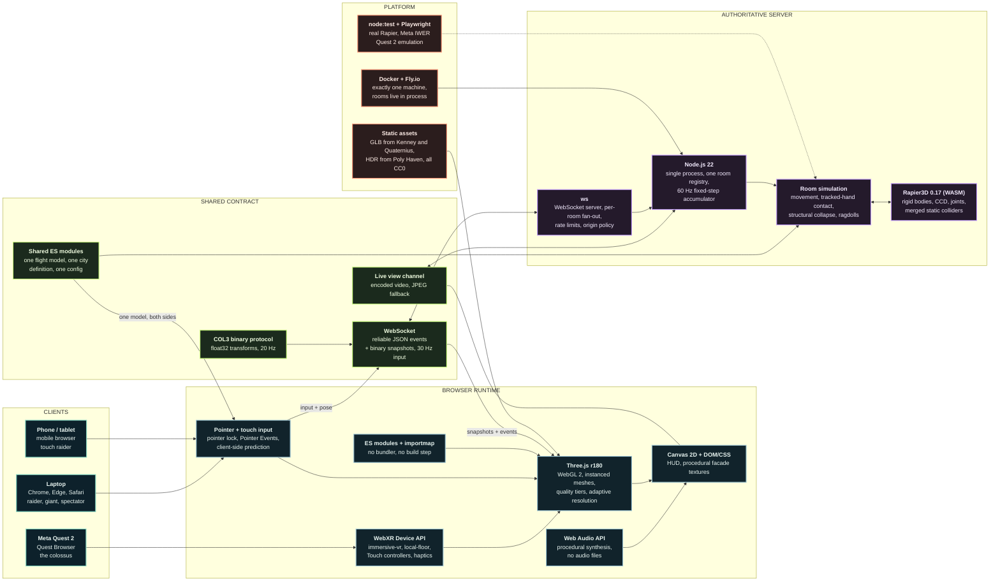
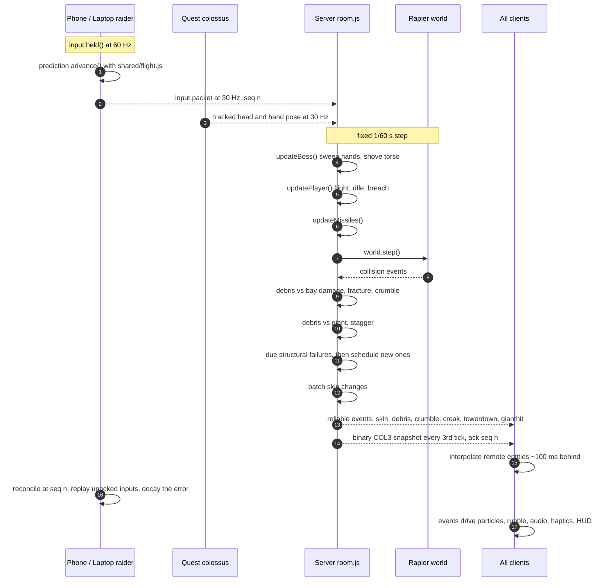

# Colossus City — architecture diagrams

Three views of the same system: the stack it runs on, how a building actually comes apart, and
what happens inside one authoritative tick. GitHub renders these natively.

## 1. Tech stack

One slide's worth: every technology the game runs on and how they connect. No individual files —
for those see [MODULES.md](MODULES.md).

## 2. How a tower comes down

Four stages. Damage peels the skins before it ever reaches structure, and structure fails on a
load model rather than on hit points alone — which is why collapses read as progressive.

```mermaid
%%{init: {"flowchart": {"nodeSpacing": 44, "rankSpacing": 62, "htmlLabels": true, "curve": "basis"}} }%%
flowchart LR

classDef hit fill:#2b1d1d,stroke:#ff9a7a,stroke-width:2px,color:#ffeee8
classDef skin fill:#11232b,stroke:#9ec7d6,stroke-width:2px,color:#eaf6f2
classDef load fill:#241a2b,stroke:#c6a0ff,stroke-width:2px,color:#f4ecff
classDef out fill:#1b2a1d,stroke:#ceff83,stroke-width:2px,color:#f2ffe2

subgraph A["1 · IMPACT"]
  direction TB
  SRC["<b>Damage source</b><br/>tracked hand, torso shove,<br/>rifle, breach bolt, missile,<br/>soaring raider, falling debris"]
  SIDE["<b>Which wall took it</b><br/>dominant horizontal axis"]
  SRC --> SIDE
end

subgraph B["2 · SKINS"]
  direction TB
  GLASS["<b>Glass shatters first</b><br/>cheap, loud, cosmetic shards"]
  FACADE["<b>Facade cracks</b><br/>brick, limestone, concrete<br/>absorbs the hit, shields the frame"]
  OPEN["<b>Solid layer gone = an opening</b><br/>collider removed, raiders and<br/>rockets fly straight through"]
  GLASS --> FACADE --> OPEN
end

subgraph C["3 · INTEGRITY"]
  direction TB
  FRAME["<b>Structural frame HP</b><br/>lower storeys are stronger"]
  GRAPH["<b>Graph support</b><br/>is there still a path<br/>to a foundation?"]
  LOADM["<b>Load model</b><br/>weight down each stack,<br/>hanging bays beam to neighbours,<br/>capacity = stack x safety x HP"]
  CREAK["<b>Overloaded, so it creaks</b><br/>failure scheduled with jitter"]
  FRAME --> GRAPH
  FRAME --> LOADM --> CREAK
end

subgraph E["4 · COLLAPSE"]
  direction TB
  CRUSH["<b>Column crushed to rubble</b><br/>never left propping<br/>the storeys above"]
  ISLAND["<b>Severed section becomes<br/>one rigid island</b><br/>and topples about whatever stands"]
  BREAKUP["<b>Hard landing breaks it up</b><br/>island to floor bands to bays,<br/>lone bays crumble to rubble"]
  DOMINO["<b>Debris keeps hitting things</b><br/>batters neighbours, crushes the<br/>giant on its head or core"]
  CRUSH --> ISLAND --> BREAKUP --> DOMINO
end

SIDE --> GLASS
OPEN --> FRAME
GRAPH --> ISLAND
CREAK --> CRUSH
DOMINO -->|"cascades back in"| SRC

class SRC,SIDE,DOMINO hit
class GLASS,FACADE,OPEN skin
class FRAME,GRAPH,LOADM,CREAK load
class CRUSH,ISLAND,BREAKUP out
```

## 3. One authoritative tick

The server owns everything. The client only predicts its own raider, using the same flight
model, and reconciles on the next snapshot.

## Reading the stack

- **Teal** is the three devices. One codebase serves all of them; the role and the input scheme
  are decided at runtime, not at build time.
- **Blue** is the browser runtime — platform APIs plus Three.js. There is no bundler and no build
  step: the browser loads ES modules through an importmap, which is why a hackathon checkout runs
  with `npm start` and nothing else.
- **Green** is the contract, and it is the load-bearing idea. `shared/` is pure logic with no
  Three.js, Rapier, DOM or Node in it, imported unchanged by both sides — that is why the client
  can predict flight exactly and why the server never has to trust a client. Alongside it sits the
  wire: reliable JSON for events, a versioned binary snapshot for transforms.
- **Purple** is authority. Nothing in the client decides damage, position or structural failure.
- **Orange** is everything around the game: hosting, CC0 art, and the test rigs that run real
  physics and an emulated Quest 2.

See [MODULES.md](MODULES.md) for the file-by-file map and the rules for changing each layer,
and [ARCHITECTURE.md](ARCHITECTURE.md) for the budgets and failure modes.
