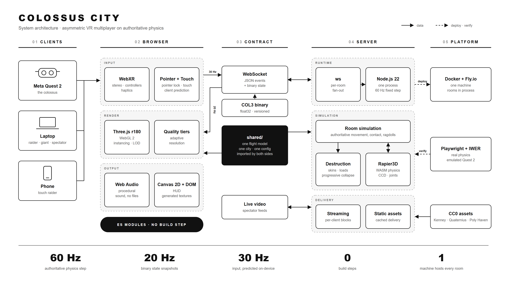
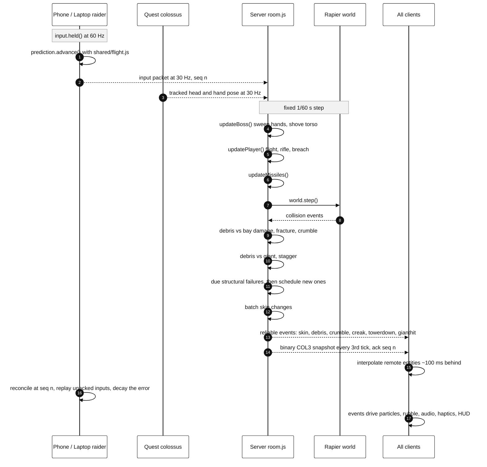

# Colossus City — architecture



One slide at 1920 x 1080: drop [architecture.png](architecture.png) into a deck or edit [architecture.svg](architecture.svg) directly. A plain-text copy for speaker notes is in [architecture.txt](architecture.txt); the file-by-file map is in [MODULES.md](MODULES.md).

## Text version

```text
┌─────────────────────────────────────────────────────────────────────────────────┐
│ CLIENTS    Meta Quest 2 (colossus) · Laptop (raider, giant, spectator) · Phone  │
└───────────────────────────────────────┬─────────────────────────────────────────┘
                                        │  WebXR poses · pointer · touch
┌───────────────────────────────────────▼─────────────────────────────────────────┐
│ BROWSER    Three.js r180 · WebXR · Web Audio · Canvas 2D + DOM · ES modules     │
│            client-side prediction runs the shared flight model                  │
└───────────────────────────────────────┬─────────────────────────────────────────┘
                          input 30 Hz ▲ │  ▼ snapshots 20 Hz
┌───────────────────────────────────────▼─────────────────────────────────────────┐
│ CONTRACT   shared/ modules · WebSocket · COL3 binary protocol · live video      │
└───────────────────────────────────────┬─────────────────────────────────────────┘
                                        │  one authoritative world
┌───────────────────────────────────────▼─────────────────────────────────────────┐
│ SERVER     Node.js 22 · ws · Rapier3D (WASM)                                    │
│            room simulation -> destruction -> streaming   60 Hz fixed step       │
└───────────────────────────────────────┬─────────────────────────────────────────┘
                                        │  deploy · verify
┌───────────────────────────────────────▼─────────────────────────────────────────┐
│ PLATFORM   Docker + Fly.io · CC0 assets · Playwright + Meta IWER                │
└─────────────────────────────────────────────────────────────────────────────────┘
```

- **01 Clients** — Meta Quest 2 plays the colossus in WebXR. Laptops play raiders, the desktop giant or spectate. Phones play touch raiders.
- **02 Browser** — Three.js r180 on WebGL 2 with instancing, LOD and adaptive quality tiers. WebXR for stereo, controllers and haptics. Pointer lock and touch input with client-side prediction. Web Audio for procedural sound. Canvas 2D and DOM for the HUD and generated textures. Native ES modules, no build step.
- **03 Contract** — shared/ modules imported unchanged by both sides: one flight model, one city, one config. WebSocket carries JSON events and the COL3 binary state format. A live video channel feeds spectators.
- **04 Server** — Node.js 22, one process, 60 Hz fixed step. ws fans out per room. Rapier3D (WASM) runs the physics. Authoritative room simulation, structural destruction with progressive collapse, per-client city streaming and cached asset delivery.
- **05 Platform** — Docker on Fly.io, exactly one machine. CC0 art from Kenney, Quaternius and Poly Haven. Playwright with Meta IWER tests real physics against an emulated Quest 2.

**One frame**

1. A device reads input; the browser predicts locally with the shared flight model.
2. Input and headset poses reach the server at 30 Hz over WebSocket.
3. The server steps Rapier at 60 Hz: movement, hand contact, destruction.
4. Every client receives events plus a binary snapshot at 20 Hz.
5. Clients interpolate about 100 ms behind; the local player reconciles.

**Key numbers:** 60 Hz physics · 20 Hz snapshots · 30 Hz input · 0 build steps · 1 machine

## Appendix A — how a tower comes down

Four stages. Damage peels the skins before it ever reaches structure, and structure fails on a
load model rather than on hit points alone — which is why collapses read as progressive.

```mermaid
%%{init: {"theme":"base","themeVariables":{"primaryColor":"#ffffff","primaryTextColor":"#111111","primaryBorderColor":"#111111","secondaryColor":"#ffffff","tertiaryColor":"#ffffff","background":"#ffffff","lineColor":"#111111","textColor":"#111111","clusterBkg":"#ffffff","clusterBorder":"#b8b8b8","edgeLabelBackground":"#ffffff"},"flowchart":{"nodeSpacing":44,"rankSpacing":62,"htmlLabels":true,"curve":"basis"}} }%%
flowchart LR

subgraph A["1 · IMPACT"]
  direction TB
  SRC["<b>Damage source</b><br/>tracked hand, torso shove,<br/>rifle, breach bolt, missile,<br/>soaring raider, falling debris"]
  SIDE["<b>Which wall took it</b><br/>dominant horizontal axis"]
  SRC --> SIDE
end

subgraph B["2 · SKINS"]
  direction TB
  GLASS["<b>Glass shatters first</b><br/>cheap, loud, cosmetic shards"]
  FACADE["<b>Facade cracks</b><br/>brick, limestone, concrete<br/>absorbs the hit, shields the frame"]
  OPEN["<b>Solid layer gone = an opening</b><br/>collider removed, raiders and<br/>rockets fly straight through"]
  GLASS --> FACADE --> OPEN
end

subgraph C["3 · INTEGRITY"]
  direction TB
  FRAME["<b>Structural frame HP</b><br/>lower storeys are stronger"]
  GRAPH["<b>Graph support</b><br/>is there still a path<br/>to a foundation?"]
  LOADM["<b>Load model</b><br/>weight down each stack,<br/>hanging bays beam to neighbours,<br/>capacity = stack x safety x HP"]
  CREAK["<b>Overloaded, so it creaks</b><br/>failure scheduled with jitter"]
  FRAME --> GRAPH
  FRAME --> LOADM --> CREAK
end

subgraph E["4 · COLLAPSE"]
  direction TB
  CRUSH["<b>Column crushed to rubble</b><br/>never left propping<br/>the storeys above"]
  ISLAND["<b>Severed section becomes<br/>one rigid island</b><br/>and topples about whatever stands"]
  BREAKUP["<b>Hard landing breaks it up</b><br/>island to floor bands to bays,<br/>lone bays crumble to rubble"]
  DOMINO["<b>Debris keeps hitting things</b><br/>batters neighbours, crushes the<br/>giant on its head or core"]
  CRUSH --> ISLAND --> BREAKUP --> DOMINO
end

SIDE --> GLASS
OPEN --> FRAME
GRAPH --> ISLAND
CREAK --> CRUSH
DOMINO -->|"cascades back in"| SRC

```



## Appendix B — one authoritative tick

The server owns everything. The client only predicts its own raider, using the same flight
model, and reconciles on the next snapshot.



See [MODULES.md](MODULES.md) for the file-by-file map and [ARCHITECTURE.md](ARCHITECTURE.md) for budgets and failure modes.
