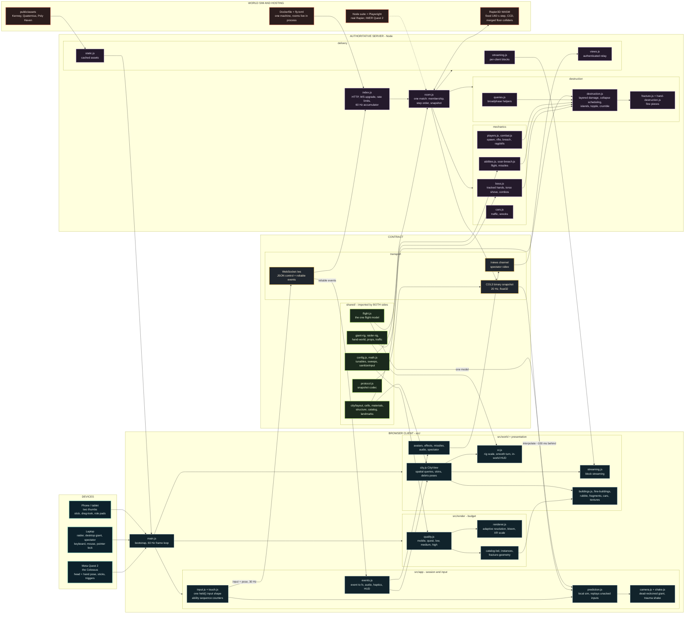
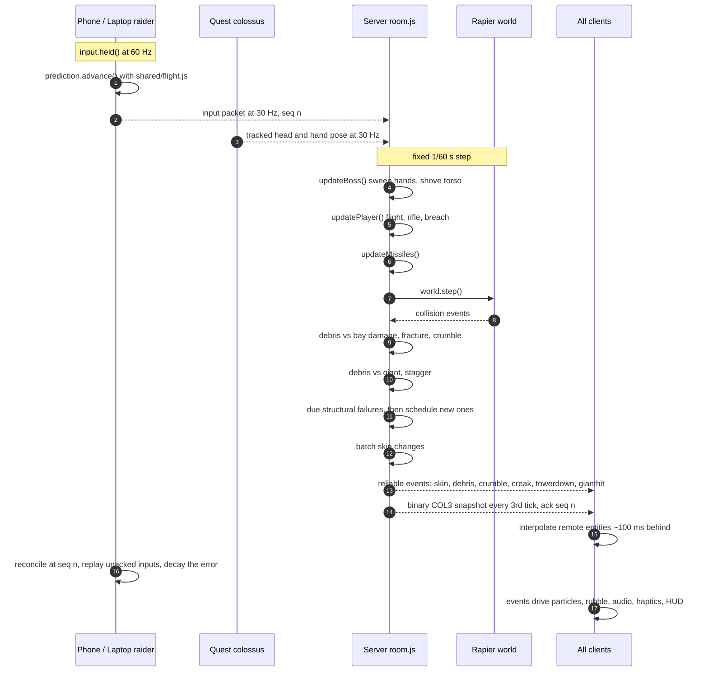

# Colossus City — architecture diagrams

Three views of the same system: what talks to what, how a building actually comes apart, and
what happens inside one authoritative tick. GitHub renders these natively.

## 1. System architecture

Devices on the left, authority on the right, and `shared/` deliberately in the middle: it is the
only code both sides import, which is why the client can predict flight exactly and why the
server never has to trust a client for anything.

## 2. How a tower comes down

Every bay is a hollow storey: slab, four corner columns and exterior skins. Damage peels the
skins before it ever reaches structure, and structure fails on a load model rather than on hit
points alone.

```mermaid
flowchart LR

classDef hit fill:#2b1d1d,stroke:#ff9a7a,color:#ffeee8
classDef skin fill:#11232b,stroke:#9ec7d6,color:#eaf6f2
classDef load fill:#241a2b,stroke:#c6a0ff,color:#f4ecff
classDef out fill:#1b2a1d,stroke:#ceff83,color:#f2ffe2

SRC["Damage source<br/>tracked hand sweep, torso shove,<br/>rifle round, breach bolt, missile,<br/>soaring raider, falling debris"]:::hit
SIDE["facingSide()<br/>which wall took it"]:::hit
GLASS{"glass intact<br/>on that side?"}:::skin
POP["Windows shatter<br/>skin event, shards, tinkle"]:::skin
FACADE{"facade standing?"}:::skin
CRACK["Facade cracks<br/>absorbs most of the hit,<br/>shields the frame"]:::skin
OPEN["Solid layer gone<br/>collider removed, the bay is now an opening<br/>raiders and rockets fly through"]:::skin
FRAME["Structural frame HP<br/>lower storeys are stronger"]:::load
GRAPH["unsupportedCells()<br/>graph path to a foundation"]:::load
LOADM["structuralLoads()<br/>weight down each stack,<br/>hanging bays beam to neighbours,<br/>capacity = stack x safety x HP ratio"]:::load
OVER{"carried > capacity?"}:::load
CREAK["Creak<br/>scheduled failure + jitter"]:::load
CRUSH["Column crushed to rubble at once<br/>never left propping the storeys above"]:::out
ISLAND["Severed section becomes<br/>ONE rigid island"]:::out
TOPPLE["topple(): angular velocity about<br/>the far edge of what still stands"]:::out
LAND{"hard landing?"}:::out
BANDS["Island splits into floor bands,<br/>bands into bays"]:::out
CRUMBLE["Lone bay crumbles<br/>body freed, cosmetic rubble on clients"]:::out
DOMINO["Chunk batters what it lands on<br/>and crushes the giant on its head or core"]:::hit

SRC --> SIDE --> GLASS
GLASS -- yes --> POP --> FACADE
GLASS -- no --> FACADE
FACADE -- yes --> CRACK --> FRAME
FACADE -- no --> FRAME
CRACK -.-> OPEN
POP -.-> OPEN
FRAME --> GRAPH
FRAME --> LOADM
LOADM --> OVER
OVER -- yes --> CREAK --> CRUSH
OVER -- no --> LOADM
GRAPH --> ISLAND
CRUSH --> GRAPH
ISLAND --> TOPPLE --> LAND
LAND -- yes --> BANDS --> CRUMBLE
LAND -- no --> DOMINO
BANDS --> DOMINO
DOMINO --> SRC
```

## 3. One authoritative tick

The server owns everything. The client only predicts its own raider, using the same flight
model, and reconciles on the next snapshot.

## Reading the first diagram

- **Green** is `shared/` — pure logic with no Three.js, Rapier, DOM or Node in it. It is imported
  unchanged by both sides, which is why the client can predict flight exactly and why an analog
  thumbstick value survives to the server untouched.
- **Amber** is the wire. Control and gameplay events are reliable JSON; transforms are a
  versioned binary snapshot. Bump `MAGIC` in `shared/protocol.js` and every client must reload.
- **Purple** is authority. Nothing in the client decides damage, position or structural failure.
- **Red** is the physics world and anything that can hurt something.

See [MODULES.md](MODULES.md) for the file-by-file map and the rules for changing each layer,
and [ARCHITECTURE.md](ARCHITECTURE.md) for the budgets and failure modes.
